# 카르노맵의 시각적 패턴과 Boolean 공간 구조의 대응 관계 연구

**4변수 완전대칭함수의 시각 패턴 분류와 Hamming Weight 층 구조를 이용한 해석**

---

## 초록

카르노맵(Karnaugh Map)은 일반적으로 논리함수의 최소화를 위한 도구로 사용되며, 교육 현장에서도 SOP 및 POS 형태의 간소화 과정에 초점을 맞추어 설명되는 경우가 많다. 그러나 실제 카르노맵에는 체커보드 패턴, 이중대각 패턴, 고리 패턴 등 다양한 시각적 구조가 나타나며, 이러한 구조는 단순한 배열 결과가 아니라 Boolean 함수의 구조적 특성을 반영할 가능성이 있다.

본 연구에서는 4변수 카르노맵에 나타나는 완전대칭함수(Symmetric Boolean Function)의 시각 패턴을 분석하고, 이를 Hamming Weight 기반 Layer 구조의 관점에서 해석하였다. 특히 Exactly-k 함수와 XOR/XNOR 함수를 대상으로 Gray Code 배열(0132)과 일반 이진 배열(0123)을 비교하여 시각 패턴과 구조적 특성의 관계를 분석하였다.

분석 결과, Exactly-0 및 Exactly-4 함수는 점 패턴(Point Pattern), Exactly-1 및 Exactly-3 함수는 모서리 패턴(Corner Pattern), Exactly-2 함수는 고리 패턴(Ring Pattern)을 형성하였다. 또한 XOR 및 XNOR 함수는 배열 방식에 따라 체커보드 패턴(Checkerboard Pattern) 또는 이중대각 패턴(Double-Diagonal Pattern)으로 표현되었다. 특히 XOR 체커보드는 홀수 Layer 선택 구조와 Gray Code 배열의 인접성 보존 성질이 결합되어 형성되는 현상으로 해석할 수 있음을 확인하였다.

본 연구는 완전대칭함수를 특정 Layer 또는 Layer 집합을 선택하는 함수로 해석할 수 있음을 보이며, 카르노맵의 시각 패턴이 Layer 구조와 배열 방식의 상호작용 결과로 이해될 수 있음을 제안한다. 이를 통해 카르노맵을 단순한 논리 최소화 도구가 아니라 Boolean 공간의 구조를 시각적으로 표현하는 도구로 해석하는 새로운 관점을 제시한다.

---

## 1. 서론

### 1.1 연구 배경

카르노맵은 디지털 논리회로 설계에서 논리식을 최소화하기 위한 대표적인 도구로 사용된다. 일반적인 교육 과정에서는 카르노맵의 인접 셀을 그룹화하여 SOP(Sum of Products) 또는 POS(Product of Sums) 형태의 최소 논리식을 도출하는 방법을 중심으로 설명한다.

그러나 실제 카르노맵을 관찰하면 단순한 그룹화 이상의 다양한 시각적 구조가 존재한다. 특히 XOR 및 XNOR 함수의 경우 일반적인 직사각형 그룹과는 다른 체커보드 형태의 패턴이 나타난다. 또한 배열 방식에 따라 동일한 논리함수가 체커보드, 대각선, 이중대각선 등 서로 다른 시각적 구조로 표현될 수 있다.

기존의 카르노맵 교육은 이러한 시각적 구조에 대한 설명보다는 최소화 절차에 집중하는 경향이 있으며, XOR/XNOR 패턴 역시 예외적인 사례로 간단히 소개되거나 별도의 설명 없이 넘어가는 경우가 많다. 그 결과 학습자는 카르노맵을 단순 계산 도구로 인식하게 되며, 카르노맵이 내포하고 있는 구조적 의미를 충분히 이해하기 어렵다.

### 1.2 연구 목적

본 연구의 목적은 카르노맵에 나타나는 시각적 패턴을 체계적으로 분류하고, 이러한 패턴이 Boolean 함수의 구조와 어떠한 관계를 가지는지 탐구하는 데 있다.

특히 XOR/XNOR 함수에 나타나는 체커보드 패턴과 완전대칭함수에 나타나는 다양한 패턴을 비교 분석하여, 시각 패턴이 단순한 배열 결과가 아니라 함수의 구조적 특성을 반영하는 현상임을 확인하고자 한다.

또한 Hamming Weight 관점을 도입하여 각 함수를 Boolean 공간의 Layer 구조로 해석하고, 카르노맵의 시각 패턴이 이러한 구조의 2차원 표현으로 이해될 수 있음을 보이고자 한다.

### 1.3 연구 범위 및 방법

본 연구는 4변수 카르노맵을 대상으로 수행하였다. 4변수 카르노맵은 총 16개의 입력 상태를 포함하며, XOR/XNOR 패턴과 다양한 대칭 구조를 가장 직관적으로 관찰할 수 있는 규모이다.

연구 방법은 다음과 같다.

첫째, 완전대칭함수 중 Exactly-k 함수와 XOR/XNOR 함수를 선정하여 카르노맵 패턴을 분석하였다.

둘째, Gray Code 배열(0132)과 일반 이진 배열(0123)을 각각 적용하여 표현 방식에 따른 패턴 변화를 비교하였다.

셋째, Hamming Weight를 기준으로 Boolean 공간을 Layer 구조로 분류하고, 각 함수가 선택하는 Layer와 카르노맵 패턴 사이의 관계를 분석하였다.

넷째, 시각적 대칭, 시각적 동일, 체커보드 패턴, 이중대각 패턴 등의 개념을 정의하고 이를 이용하여 패턴을 분류하였다.

---

## 2. 이론적 배경

### 2.1 카르노맵의 구조

카르노맵은 Boolean 함수를 시각적으로 표현하여 논리식의 최소화를 수행하기 위한 도구이다. 4변수 카르노맵은 총 16개의 셀로 구성되며, 각 셀은 입력 변수 $A, B, C, D$의 하나의 상태에 대응한다.

일반적인 진리표는 이진수 순서에 따라 상태를 배열하지만, 카르노맵은 인접한 상태가 하나의 변수만 다르도록 배치된다. 이를 통해 인접 셀을 그룹화하여 논리식을 간단하게 표현할 수 있다.

기존 연구와 교육에서는 이러한 최소화 기능에 주목하는 경우가 많다. 그러나 카르노맵은 단순한 계산 도구를 넘어 Boolean 공간의 구조를 시각적으로 표현하는 도구로도 해석할 수 있다. 본 연구에서는 카르노맵을 Boolean 공간의 2차원 표현으로 간주하고, 그 위에 나타나는 시각 패턴을 분석 대상으로 삼는다.

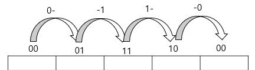

**그림 1.** 4변수 카르노맵에서 사용되는 Gray Code 배열(0132)의 구조. 인접한 셀이 항상 하나의 변수만 다르도록 배치되어 있으며, Boolean 공간의 인접성 구조를 보존한다.

### 2.2 Gray Code 배열과 일반 이진 배열

4변수 카르노맵의 행과 열은 일반적으로 Gray Code 순서인 `00, 01, 11, 10`으로 배열된다. 이 배열 방식은 인접한 두 상태가 정확히 하나의 비트만 다르도록 설계되어 있으며, 인접 상태 사이의 Hamming Distance가 항상 1이 된다는 성질을 가진다. 본 연구에서는 이를 **0132 배열**이라 부른다.

반면 일반적인 이진수 순서인 `00, 01, 10, 11`을 **0123 배열**이라 부른다.

동일한 Boolean 함수라도 배열 방식에 따라 서로 다른 시각 패턴이 나타날 수 있다. 예를 들어 XOR 함수는 0132 배열에서는 체커보드 패턴으로, 0123 배열에서는 이중대각 패턴으로 표현된다. 따라서 카르노맵의 시각 패턴을 이해하기 위해서는 함수뿐 아니라 배열 방식도 함께 고려할 필요가 있다.

### 2.3 완전대칭함수와 Hamming Weight

Boolean 함수가 변수의 순서와 무관하게 동일한 출력을 유지하는 경우 이를 **완전대칭함수(Symmetric Boolean Function)**라 한다. 예를 들어 $A \oplus B \oplus C \oplus D$는 변수의 순서를 어떻게 바꾸어도 동일한 결과를 생성한다.

완전대칭함수는 각 변수의 위치보다 입력에 포함된 1의 개수에 의해 출력이 결정되는 경우가 많다. 본 연구에서는 입력 상태의 Hamming Weight를 다음과 같이 정의한다.

$$w = A + B + C + D$$

여기서 $w$는 입력 상태에 포함된 1의 개수를 의미한다. 4변수 Boolean 공간에서는 $w \in \{0, 1, 2, 3, 4\}$의 다섯 가지 값이 가능하며, 각 $w$에 해당하는 상태의 수는 $\binom{4}{w}$이다.

### 2.4 Boolean 공간의 Layer 구조

4변수 Boolean 공간은 총 16개의 상태로 구성된다. 본 연구에서는 이 공간을 Hamming Weight를 기준으로 다섯 개의 Layer로 분류한다.

| Layer | Weight ($w$) | 상태 수 $\binom{4}{w}$ |
|:---:|:---:|:---:|
| $L_0$ | 0 | 1 |
| $L_1$ | 1 | 4 |
| $L_2$ | 2 | 6 |
| $L_3$ | 3 | 4 |
| $L_4$ | 4 | 1 |

**표 1.** 4변수 Boolean 공간의 Layer 구조. 각 층의 상태 수는 $1\text{-}4\text{-}6\text{-}4\text{-}1$ 구조를 이루며, 이는 파스칼 삼각형의 계수와 대응된다.

이 구조는 파스칼 삼각형의 계수 $1\text{-}4\text{-}6\text{-}4\text{-}1$과 대응된다. 본 연구에서는 이 Layer 구조를 Boolean 공간의 기본 골격으로 해석한다.

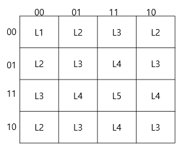

**그림 2.** 4변수 Boolean 공간을 Hamming Weight에 따라 Layer로 분류한 결과. 각 Layer의 상태 수는 $1\text{-}4\text{-}6\text{-}4\text{-}1$ 구조를 이루며 파스칼 삼각형 계수와 대응된다.

### 2.5 Layer 구조와 시각 패턴

완전대칭함수는 특정 Layer 또는 Layer 집합을 선택하는 함수로 이해할 수 있다.

| 함수 | 선택 Layer |
|:---:|:---:|
| Exactly-$k$ | $L_k$ |
| XOR | $L_1 \cup L_3$ |
| XNOR | $L_0 \cup L_2 \cup L_4$ |

이러한 관점에서 카르노맵의 시각 패턴은 Layer 선택 결과의 2차원 표현으로 해석할 수 있다. 본 연구는 다음 해석 틀을 사용한다.

$$\text{Boolean 함수} \;\xrightarrow{\text{Layer 선택}}\; \text{Layer 구조} \;\xrightarrow{\text{배열 방식}}\; \text{시각 패턴}$$

즉 Layer 구조는 함수의 본질적 특성을 나타내며, 시각 패턴은 그 구조가 특정 배열 방식 위에 표현된 결과로 해석한다.

---

## 3. 시각 패턴의 정의

### 3.1 시각적 대칭

본 연구에서는 카르노맵의 구조를 분석하기 위하여 **시각적 대칭(Visual Symmetry)**의 개념을 정의한다. 시각적 대칭이란 특정 축에 대하여 카르노맵을 반사하였을 때 대응되는 위치의 값이 동일하게 유지되는 성질을 의미한다.

- **세로축 대칭:** $F(a, b) = F(a, 5-b)$
- **가로축 대칭:** $F(a, b) = F(5-a, b)$
- **주대각선 대칭:** $F(a, b) = F(b, a)$

### 3.2 시각적 동일

**시각적 동일(Visual Repetition)**은 시각적 대칭과 구별되는 개념이다. 시각적 동일이란 특정 부분 패턴이 반복적으로 나타나는 현상을 의미한다. 시각적 대칭이 반사 관계를 의미한다면, 시각적 동일은 반복 관계를 의미한다. 따라서 두 개념은 독립적으로 존재할 수 있다.

### 3.3 체커보드 패턴

**체커보드 패턴(Checkerboard Pattern)**은 인접한 셀의 값이 항상 서로 반대가 되는 패턴을 의미한다.

```
0 1 0 1
1 0 1 0
0 1 0 1
1 0 1 0
```

Gray Code 배열에서는 인접 셀이 정확히 하나의 변수만 다르므로, XOR 함수의 경우 인접 셀 이동 시 출력이 반드시 반전된다. 본 연구에서는 체커보드 패턴을 **인접성 기반 패턴(adjacency-based pattern)**으로 분류한다.

### 3.4 이중대각 패턴

일반 이진 배열(0123)에서 XOR 함수를 표현하면 다음과 같은 패턴이 나타난다.

```
0 1 1 0
1 0 0 1
1 0 0 1
0 1 1 0
```

이 패턴은 주대각선과 부대각선 모두에 대한 대칭성을 동시에 가진다. 본 연구에서는 이를 **이중대각 패턴(Double-Diagonal Pattern)**이라 정의한다.

### 3.5 고리 패턴

Exactly-2 함수는 Weight가 정확히 2인 상태만 선택한다. 이를 Gray Code 기반 0132 배열에 배치하면 선택된 상태들이 중심 영역을 둘러싸는 띠(band) 형태의 연결 구조를 형성한다. 인간은 이러한 구조를 하나의 폐곡선 또는 고리와 유사한 형태로 인식할 수 있다. 본 연구에서는 이를 **고리 패턴(Ring Pattern)**이라 정의한다.

### 3.6 시각 패턴 분류 체계

본 연구에서 관찰된 주요 시각 패턴은 다음과 같이 분류할 수 있다.

| 패턴 | 대표 함수 | 선택 Layer |
|:---|:---:|:---:|
| 점 패턴 (Point Pattern) | Exactly-0, Exactly-4 | $L_0$, $L_4$ |
| 모서리 패턴 (Corner Pattern) | Exactly-1, Exactly-3 | $L_1$, $L_3$ |
| 고리 패턴 (Ring Pattern) | Exactly-2 | $L_2$ |
| 체커보드 패턴 (0132 배열) | XOR, XNOR | $L_1 \cup L_3$, $L_0 \cup L_2 \cup L_4$ |
| 이중대각 패턴 (0123 배열) | XOR, XNOR | $L_1 \cup L_3$, $L_0 \cup L_2 \cup L_4$ |

**표 2.** 카르노맵에 나타나는 시각 패턴 분류 체계. 분류 기준은 논리식이 아닌 카르노맵 위에 나타나는 시각적 구조이다.

---

## 4. 완전대칭함수의 시각 패턴 분석

### 4.1 분석 대상

본 연구에서는 Hamming Weight만으로 출력이 결정되는 다음 완전대칭함수들을 분석 대상으로 선정하였다: Exactly-0, Exactly-1, Exactly-2, Exactly-3, Exactly-4, XOR, XNOR. 이 함수들은 모두 Weight 층 구조와 직접적으로 연결되며, Layer 기반 해석이 가능하다.

### 4.2 Exactly-0 함수

Exactly-0 함수는 모든 입력이 0인 경우에만 출력이 1이 된다. 즉 $L_0$만을 선택하는 함수이다. 선택되는 상태는 단 하나뿐이므로 카르노맵에서는 하나의 점으로 표현된다. 본 연구에서는 이를 **점 패턴(Point Pattern)**으로 분류한다.

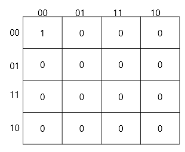

**그림 3.** Exactly-0 함수의 카르노맵 표현. Weight = 0 상태만 선택되므로 하나의 점(Point Pattern)으로 나타난다.

### 4.3 Exactly-1 함수

Exactly-1 함수는 입력 중 정확히 하나만 1인 경우 출력이 1이 된다. 즉 $L_1$을 선택하는 함수이다. Weight = 1 상태는 총 4개 존재하며 카르노맵에서는 서로 떨어진 위치에 배치된다. 그 결과 네 개의 점이 모서리 방향으로 분산된 구조가 나타난다. 본 연구에서는 이를 **모서리 패턴(Corner Pattern)**으로 분류한다.

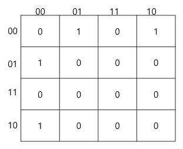

**그림 4.** Exactly-1 함수의 카르노맵 표현. Weight = 1 상태 네 개가 선택되며 모서리 방향으로 분산된 구조를 형성한다.

### 4.4 Exactly-2 함수

Exactly-2 함수는 Weight가 정확히 2인 상태만 선택한다. 즉 $L_2$를 선택하는 함수이다. Weight = 2 상태는 총 6개 존재하며 4변수 Boolean 공간에서 가장 큰 Layer를 형성한다$\bigl(\binom{4}{2} = 6\bigr)$.

이를 0132 배열에 배치하면 선택된 셀들이 연결된 띠 형태를 형성하며, 인간은 이를 하나의 폐곡선 또는 고리와 유사한 형태로 인식한다. 따라서 Exactly-2의 고리 패턴은 $L_2$의 구조와 Gray Code 배열의 인접성 보존 성질이 결합된 결과로 해석할 수 있다.

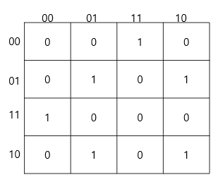

**그림 5.** Exactly-2 함수의 카르노맵 표현. Weight = 2 상태 여섯 개가 Gray Code 배열 위에서 연결된 띠 형태를 형성하며, 시각적으로 고리(Ring Pattern)에 가까운 구조로 인식된다.

### 4.5 Exactly-3 함수

Exactly-3 함수는 $L_3$을 선택한다. Weight = 3 상태의 수는 $\binom{4}{3} = 4$로 Weight = 1 상태의 수와 동일하다. 카르노맵에서는 Exactly-1과 동일한 시각 구조를 형성한다. 따라서 Exactly-1과 Exactly-3은 서로 다른 Layer를 선택하지만 동일한 모서리 패턴으로 분류된다.

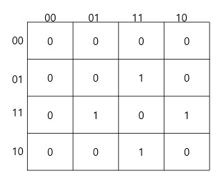

**그림 6.** Exactly-3 함수의 카르노맵 표현. Weight = 3 상태가 선택되며 Exactly-1과 대응되는 모서리 패턴을 형성한다.

### 4.6 Exactly-4 함수

Exactly-4 함수는 모든 입력이 1인 경우에만 출력이 1이 된다. 즉 $L_4$만을 선택한다. 선택되는 상태는 1개이며 Exactly-0과 마찬가지로 점 패턴을 형성한다. Exactly-0과 Exactly-4는 Boolean 공간의 양 끝 Layer에 해당하는 구조적 대응 관계를 가진다.

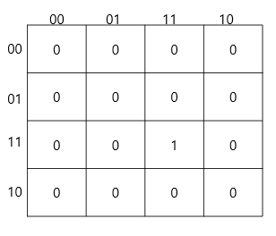

**그림 7.** Exactly-4 함수의 카르노맵 표현. Weight = 4 상태만 선택되며 Exactly-0과 대응되는 점 패턴을 형성한다.

### 4.7 XOR 함수

XOR 함수는 Weight가 홀수인 상태에서 출력이 1이 된다. 즉 $L_1 \cup L_3$을 선택한다.

- **0132 배열:** 체커보드 패턴이 나타난다.
- **0123 배열:** 이중대각 패턴이 나타난다.

이는 동일한 Layer 구조가 배열 방식에 따라 서로 다른 시각 패턴으로 표현될 수 있음을 보여준다. 그러나 두 경우 모두 동일한 홀수 Layer 선택 구조를 기반으로 하므로, 패턴의 근본 원인은 Layer 구조에 있다고 해석할 수 있다.

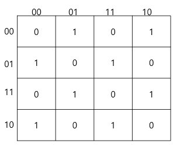

**그림 8.** Gray Code 배열에서 표현한 XOR 함수. 인접한 셀의 값이 항상 반대가 되므로 체커보드 패턴이 형성된다.


**그림 9.** 일반 이진 배열(0123)에서 표현한 XOR 함수. 체커보드 구조는 사라지며 주대각선과 부대각선 대칭을 동시에 가지는 이중대각 패턴이 나타난다.

### 4.8 XNOR 함수

XNOR 함수는 Weight가 짝수인 상태에서 출력이 1이 된다. 즉 $L_0 \cup L_2 \cup L_4$를 선택한다. 이는 XOR 함수의 보수 구조에 해당한다.

- **0132 배열:** XOR 체커보드의 반전 형태로 나타난다.
- **0123 배열:** XOR과 대응되는 이중대각 패턴이 나타난다.

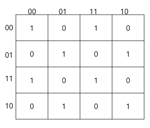

**그림 10.** Gray Code 배열에서 표현한 XNOR 함수. XOR 체커보드의 보수 구조에 해당한다.

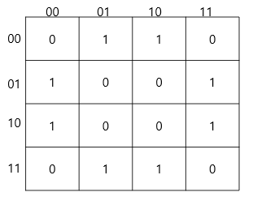

**그림 11.** 일반 이진 배열에서 표현한 XNOR 함수. XOR의 보수 구조로 나타나는 이중대각 패턴이다.

### 4.9 분석 결과 요약

분석 결과 완전대칭함수의 시각 패턴은 다음과 같이 정리할 수 있다.

| 함수 | 선택 Layer | 상태 수 | 시각 패턴 |
|:---:|:---:|:---:|:---:|
| Exactly-0 | $L_0$ | 1 | 점 패턴 |
| Exactly-1 | $L_1$ | 4 | 모서리 패턴 |
| Exactly-2 | $L_2$ | 6 | 고리 패턴 |
| Exactly-3 | $L_3$ | 4 | 모서리 패턴 |
| Exactly-4 | $L_4$ | 1 | 점 패턴 |
| XOR | $L_1 \cup L_3$ | 8 | 체커보드 / 이중대각 |
| XNOR | $L_0 \cup L_2 \cup L_4$ | 8 | 체커보드 / 이중대각 |

**표 3.** 4변수 완전대칭함수의 시각 패턴 분류 결과. XOR과 XNOR의 패턴은 배열 방식에 따라 달라진다.

이 결과는 카르노맵의 시각 패턴이 단순한 배열 결과가 아니라 Layer 구조와 표현 방식의 상호작용을 반영한다는 사실을 시사한다.

---

## 5. XOR/XNOR 패턴의 구조적 해석

### 5.1 XOR 함수와 Layer 구조

4변수 XOR 함수는 다음과 같이 정의된다.

$$A \oplus B \oplus C \oplus D = 1 \iff w \text{ 가 홀수}$$

따라서 XOR 함수는 $L_1 \cup L_3$을 선택하는 함수로 해석할 수 있다.

### 5.2 Gray Code 배열의 인접성 보존

4변수 카르노맵의 행과 열은 `00, 01, 11, 10`의 순서로 배열된다. 이 배열의 핵심 성질은 **인접한 두 상태가 정확히 하나의 비트만 다르다**는 점이다. 즉 인접 상태 사이의 Hamming Distance는 항상 1이다. 본 연구에서는 이를 **Gray Code 배열의 인접성 보존 성질**이라 부른다.

### 5.3 인접 이동과 Weight 변화

Boolean 공간에서 하나의 비트가 변경되면 Hamming Weight는 반드시 1만큼 증가하거나 감소한다.

$$L_0 \leftrightarrow L_1 \leftrightarrow L_2 \leftrightarrow L_3 \leftrightarrow L_4$$

따라서 카르노맵에서 인접한 두 셀은 항상 Weight의 홀짝성이 반대이다.

### 5.4 XOR 체커보드 패턴의 형성

위 성질들을 결합하면 XOR 체커보드 패턴의 형성 과정을 다음과 같이 설명할 수 있다.

$$\text{XOR} \;\Rightarrow\; L_1 \cup L_3 \;\Rightarrow\; \text{Gray Code 인접성} \;\Rightarrow\; \text{인접 셀 출력 반전} \;\Rightarrow\; \text{체커보드 패턴}$$

따라서 체커보드 패턴은 단순한 시각적 우연이 아니라 Boolean 공간의 구조가 2차원 카르노맵 위에 표현된 구조적 결과이다.

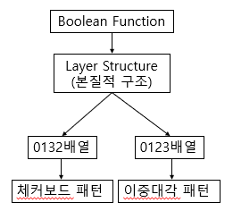

**그림 12.** XOR 함수의 체커보드 패턴 생성 과정. 홀수 Layer 선택 구조와 Gray Code 배열의 인접성 보존 성질이 결합되어 인접 셀 출력 반전이 발생하고, 그 결과 체커보드 패턴이 형성된다.

### 5.5 XNOR 함수의 해석

XNOR 함수는 XOR 함수의 보수로서 $L_0 \cup L_2 \cup L_4$를 선택한다. 짝수 Weight 층만을 선택하므로 마찬가지로 인접 셀 간 출력이 항상 반전된다. 따라서 XNOR 역시 Gray Code 배열에서 체커보드 패턴을 형성하며, 이는 XOR 체커보드의 반전 형태로 이해할 수 있다.

### 5.6 체커보드 패턴의 구조적 의미

체커보드 패턴은 완전대칭함수의 일반적 특징이 아니다. Exactly-k 함수들은 체커보드를 형성하지 않는다. 체커보드는 **홀수 Layer 전체 또는 짝수 Layer 전체를 선택하는 패리티(parity) 구조**에서만 나타나는 특수한 현상이다.

따라서 체커보드 패턴은 Boolean 공간의 패리티 구조가 Gray Code 배열을 통해 시각적으로 표현된 결과로 해석할 수 있다.

---

## 6. 배열 방식에 따른 시각 패턴 변화

### 6.1 동일한 함수와 서로 다른 패턴

카르노맵의 시각 패턴은 함수 자체에 의해서만 결정되지 않는다. 동일한 Boolean 함수라도 배열 방식에 따라 서로 다른 시각 구조가 나타날 수 있다. 본 연구에서는 XOR 함수와 Exactly-2 함수를 두 배열 방식으로 각각 표현하여 비교하였다.

### 6.2 XOR 함수의 경우

XOR 함수는 항상 $L_1 \cup L_3$를 선택하는 함수이다. 이 Layer 구조는 배열 방식과 무관하게 동일하다. 그러나 시각적 표현은 배열 방식에 따라 다음과 같이 달라진다.

**0132 배열:** Gray Code의 인접성 보존 성질에 의해 체커보드 패턴이 형성된다. 인접 셀로 이동 시 Weight 홀짝성이 반드시 반전되므로 XOR 함수의 출력이 항상 반대가 된다.

**0123 배열:** 인접성이 Boolean 공간의 인접성과 일치하지 않아 체커보드 구조가 사라진다. 대신 XOR 함수의 대칭 구조가 두드러지며 이중대각 패턴이 나타난다.

즉 동일한 XOR 함수가 배열 방식에 따라 서로 다른 시각 구조를 형성한다.

### 6.3 Exactly-2 함수의 경우

Exactly-2 함수는 항상 $L_2$를 선택한다.

**0132 배열:** Weight = 2 상태들이 연결된 띠 형태를 형성하며 고리 패턴으로 인식된다.

**0123 배열:** 동일한 여섯 상태가 다른 위치에 배치되며, 0132에서 보이던 고리 형태는 약해져 보다 분산된 구조로 나타난다.

이 결과는 고리 패턴이 $L_2$ 자체의 성질이 아니라 **Layer 구조와 0132 배열의 인접성이 결합된 결과**임을 보여준다.

### 6.4 패턴 형성의 이중 원인

시각 패턴은 하나의 원인만으로 결정되지 않는다.

| 요소 | 결정 내용 |
|:---|:---|
| **Layer 구조** (함수의 성질) | 어떤 상태가 선택되는가 |
| **배열 방식** (표현의 성질) | 선택된 상태들이 평면에서 어떤 형태로 나타나는가 |

따라서 **패턴의 근본 원인은 Layer 구조**에 있지만, **인간이 관찰하는 구체적 형태는 배열 방식**에 의해 결정된다.

### 6.5 Gray Code 배열의 역할

Gray Code 배열은 논리식 최소화를 위해 설계된 배열이지만, 본 연구 결과는 그 이상의 역할을 수행할 가능성을 시사한다. Gray Code 배열은 Boolean 공간의 인접성 구조를 보존함으로써 Layer 구조에 포함된 상태들의 관계를 시각적으로 드러내기 쉽게 만든다. 예를 들어 XOR의 체커보드 패턴과 Exactly-2의 고리 패턴은 모두 Gray Code 배열에서 더 명확하게 나타난다.

따라서 **Gray Code 배열은 Boolean 공간 구조를 시각적으로 표현하는 역할도 수행할 가능성**이 있다.

---

## 7. 결론

본 연구에서는 4변수 카르노맵에 나타나는 완전대칭함수의 시각 패턴을 분석하고, 이러한 패턴이 Boolean 공간의 Layer 구조와 어떠한 관계를 가지는지 탐구하였다.

분석 결과 완전대칭함수의 시각 패턴은 해당 함수가 선택하는 Layer 구조와 직접적으로 대응됨을 확인하였다. Exactly-0/4는 점 패턴, Exactly-1/3은 모서리 패턴, Exactly-2는 고리 패턴을 형성하며, XOR/XNOR은 배열 방식에 따라 체커보드 또는 이중대각 패턴으로 표현된다.

특히 XOR 체커보드 패턴은 단순한 시각적 우연이 아니라 **홀수 Layer 선택 구조와 Gray Code 배열의 인접성 보존 성질이 결합되어 형성되는 구조적 결과**임을 확인하였다.

또한 동일한 Layer 구조도 배열 방식에 따라 서로 다른 시각 패턴으로 표현될 수 있음을 보였다. 이는 시각 패턴이 함수의 성질과 표현 방식의 성질이 결합된 결과임을 의미한다.

본 연구는 다음과 같은 탐색적 가설을 제안한다.

> 카르노맵의 주요 시각 패턴은 Boolean 공간의 Layer 구조가 특정 배열 방식 위에 투영된 결과일 수 있다.

만약 이 가설이 타당하다면, 점 패턴, 모서리 패턴, 고리 패턴, 체커보드 패턴 등은 서로 독립적인 현상이 아니라 하나의 공통 원리로 설명될 수 있다. 즉 카르노맵은 단순한 논리 최소화 도구를 넘어 Boolean 공간의 구조를 시각적으로 표현하는 도구로 재해석될 수 있다.

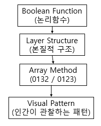

**그림 13.** 본 연구에서 제안하는 해석 모형. Boolean 함수는 특정 Layer 구조를 결정하며, 배열 방식은 이를 시각적으로 표현한다. 인간이 관찰하는 시각 패턴은 두 요소의 상호작용 결과로 해석할 수 있다.

향후 연구에서는 변수 재배열에 따른 구조 불변성, 5변수 이상의 Boolean 공간에 대한 Layer 분석, 그리고 인간의 시각적 구조 인식 과정과의 관계 등을 탐구할 필요가 있다.

---

## 참고문헌

[1] Karnaugh, M. (1953). "The Map Method for Synthesis of Combinational Logic Circuits." *Transactions of the American Institute of Electrical Engineers, Part I: Communication and Electronics*, 72(9), 593–599.

[2] Veitch, E. W. (1952). "A Chart Method for Simplifying Truth Functions." *Proceedings of the ACM*, 127–133.

[3] Gray, F. (1953). "Pulse Code Communication." U.S. Patent 2,632,058.

[4] Roth, C. H. *Fundamentals of Logic Design*. Cengage Learning.

[5] Mano, M. M. & Ciletti, M. D. *Digital Design*. Pearson.

[6] Hamming, R. W. (1950). "Error Detecting and Error Correcting Codes." *Bell System Technical Journal*, 29, 147–160.

[7] Wegener, I. (1987). *The Complexity of Boolean Functions*. John Wiley & Sons.

[8] Crama, Y. & Hammer, P. L. (2011). *Boolean Functions: Theory, Algorithms, and Applications*. Cambridge University Press.

[9] Stanley, R. P. *Enumerative Combinatorics, Volume 1*. Cambridge University Press.

[10] Knuth, D. E. *The Art of Computer Programming, Volume 4A: Combinatorial Algorithms*. Addison-Wesley.

---

*본 연구에서 제안한 점 패턴(Point Pattern), 모서리 패턴(Corner Pattern), 고리 패턴(Ring Pattern), 체커보드 패턴(Checkerboard Pattern), 이중대각 패턴(Double-Diagonal Pattern)의 분류 체계와 Layer 기반 시각 패턴 해석은 저자의 분석 결과에 기반한 탐색적 해석이다. Layer 구조 → 배열 방식 → 시각 패턴이라는 해석 틀과 XOR 체커보드 패턴의 Layer 기반 설명은 기존 카르노맵 최소화 중심 관점에 대한 보완적 해석으로 제안된다.*
